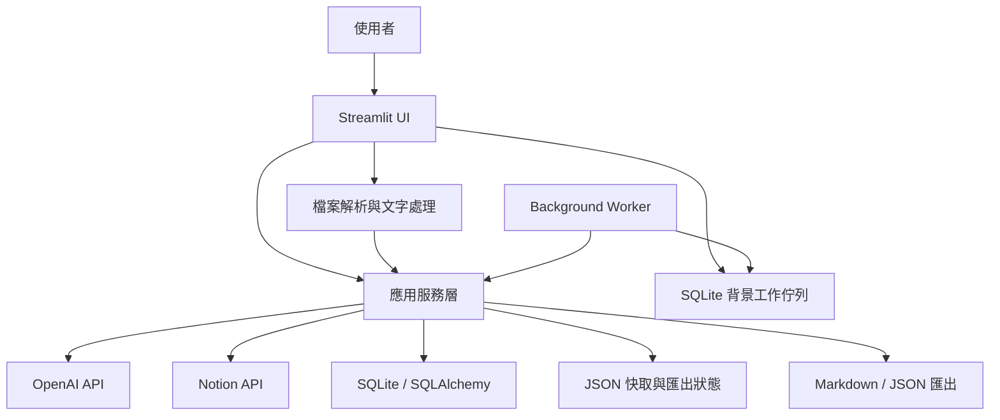

# 系統架構

## 架構總覽

系統採用分層式單體架構。所有功能在同一個 Python 專案中執行，但依責任拆成 UI、服務、處理、資料模型、儲存與外部整合層。

## 六個主要層次

### 1. 操作介面層

入口為 `AI_Notion_筆記整理器.py`，其他功能位於 `pages/`。這一層負責接收輸入、呈現狀態、呼叫服務和管理 `st.session_state`，不應直接實作資料庫交易或 API 細節。

### 2. 解析與前處理層

`src/parsers/` 根據副檔名擷取文字；`text_cleaner.py` 清理內容；`text_chunker.py` 建立有重疊的文字區塊；`chapter_detector.py` 偵測真正主章節、跨行標題與章節範圍。

### 3. AI 應用層

`analysis_service.py` 負責整份文件的分塊分析與合併，`chapter_service.py` 負責單章詳細學習筆記。提示詞放在 `src/prompts/`，回傳資料由 `src/models/` 的 Pydantic Model 驗證。

### 4. 外部整合層

`openai_service.py` 封裝 OpenAI Client；`notion_service.py` 與 `chapter_notion_service.py` 負責 Notion 頁面及區塊；`pdf_visual_service.py` 負責 PDF 頁面視覺分析。

### 5. 持久化層

SQLAlchemy Model 位於 `src/database/models.py`。`learning_database_service.py` 管理文件、章節、Quiz 與 Flash Card；練習、儀表板與維護功能各有獨立 Service。快取與 Notion 續跑狀態則以 JSON 檔保存在 `outputs/`。

### 6. 背景執行與桌面發行層

`background_job_service.py` 將耗時工作及進度寫入 SQLite，`background_worker.py` 在獨立程序中取出工作並呼叫既有 Service。`launcher.py` 同時管理 Streamlit、Worker、Port、瀏覽器與更新檢查。PyInstaller 封裝 Python 執行環境，Inno Setup 再產生單一 Windows 安裝 EXE。

### 6. 啟動與執行環境層

`launcher.py` 檢查虛擬環境依賴、初始化資料庫 Schema、尋找可用 Port、啟動 Streamlit 並開啟瀏覽器。`啟動_AI筆記整理器.bat` 是 Windows 雙擊入口。

## 為什麼選擇分層式單體

目前是單機個人應用，不需要微服務帶來的部署與網路複雜度；但解析、AI、Notion、資料庫和 UI 又具有清楚邊界，因此採分層式單體最平衡。未來改成 Web API 時，可以保留大部分 Service，只替換 UI 與儲存基礎設施。

## 關鍵邊界

| 邊界 | 輸入 | 輸出 | 主要防護 |
|---|---|---|---|
| Parser | 檔案 bytes | 純文字與 metadata | 格式與大小驗證 |
| Chapter Detector | 清理後文字 | 章節 dict 清單 | 主序列、重複編號與標題 fallback |
| AI Service | Prompt 與內容 | 結構化 JSON | 重試、JSON 解析、Pydantic 驗證 |
| Notion Service | 學習筆記 Model | Notion 頁面與 Blocks | Block 分批、續跑狀態、失敗記錄 |
| Database Service | 文件與學習項目 | SQLAlchemy 紀錄 | 交易、外鍵、非破壞性去重 |
| Practice Service | 作答或評分 | 嘗試、弱點、排程 | 合法值檢查、同交易更新 |

## 同步與非同步考量

目前 Streamlit 呼叫大多是同步流程，優點是容易追蹤進度與錯誤；代價是大型 PDF 或 Notion 匯出時頁面會等待。若未來雲端化，最適合抽離成背景工作的部分是 PDF 視覺分析、AI 分章生成和 Notion 批次匯出。

## 狀態分成三類

- UI 暫態：`st.session_state`，只服務目前瀏覽器互動。
- 業務資料：SQLite，保存文件、題目、作答、複習和弱點。
- 可重建中間產物：`outputs/` 快取與匯出狀態，降低成本並支援續跑。

這項區分很重要：題目不能只放在 Session State，否則重開程式就消失；AI 詳細筆記適合快取，因為它可由來源文件重新生成；作答紀錄必須進 SQLite，因為它是不可替代的使用者資料。

## 主要品質策略

- Schema 啟動檢查，避免 Model 已更新但舊 SQLite 尚未遷移。
- 所有外部 AI 結果先驗證，不把任意字串直接傳到 UI 或 Notion。
- 快取命中與失效原因可區分，舊格式可透過多條件 fallback 尋找。
- Notion 匯出結果會正規化，兼容字串、數字與 dict 章節結果。
- 學習項目使用正規化識別鍵去重，重新同步不刪除歷史紀錄。
- 管理頁提供資料分布、孤兒紀錄與重複資料診斷。
