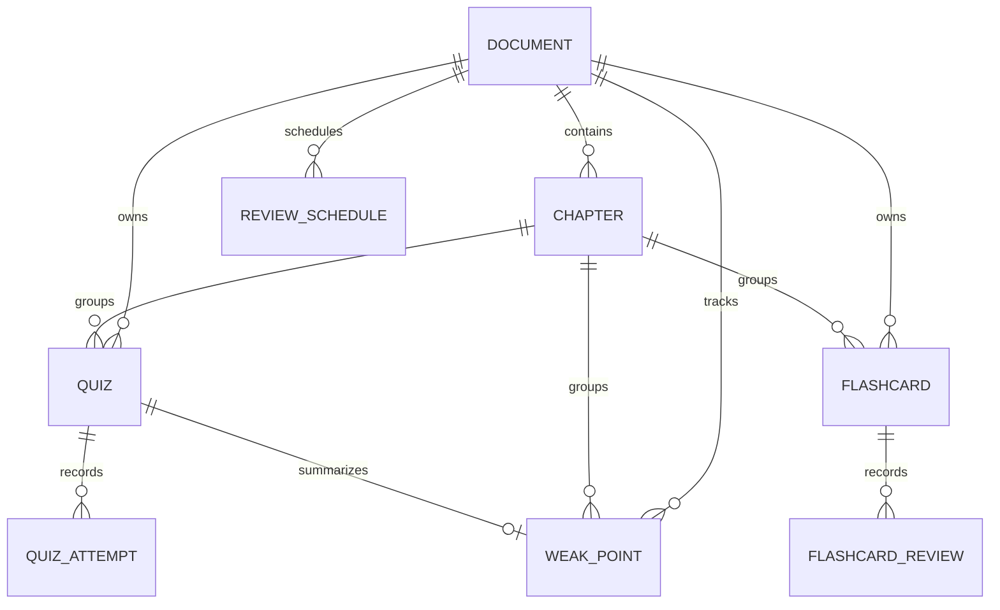

# 資料庫設計

## 資料庫定位

SQLite 儲存不可替代的業務資料：文件、章節、題目、卡片、作答、複習、排程與弱點。AI 詳細筆記及視覺分析是可重建中間產物，放在檔案快取，不混入主要 Schema。

ORM 定義位於 `src/database/models.py`，資料庫連線與 Session 位於 `src/database/database.py`，建立與檢查 Schema 位於 `src/database/init_db.py`。

## 關聯圖



## 共通設計

- 主鍵使用 `String(36)` UUID，避免不同層使用整數和字串造成型別不一致。
- 時間欄位以 `created_at`、`updated_at` 或事件時間保存。
- 文件刪除通常使用 `CASCADE`；章節刪除後，題目與卡片依 Model 設定處理。
- Service 使用 Session Context Manager，成功才 `commit`，例外則 rollback。
- `source_chapter_id` 保存原文件章節編號，`chapter_order` 保存畫面排序。

## documents

代表一份已上傳文件。`file_hash` 用 SHA-256 辨認同一份內容；`status` 是解析/分析狀態，`export_status` 是 Notion 匯出狀態。另保存章節數、Notion 父頁、Token 用量與處理時間。Document 是整個學習資料樹的根。

## chapters

代表主章節。核心欄位包括來源編號、顯示順序、描述性標題、原文索引、快取狀態和 Notion 子頁資訊。

同一文件的 `chapter_order` 不可重複，`source_chapter_id` 也不可重複。章節偵測器因此必須先處理目錄重複、兩位數編號與重複序列。

## quizzes 與 quiz_attempts

`quizzes` 保存題目本體；`quiz_attempts` 每作答一次新增一筆，保存答案、自評、分數與時間。

| 自評 | `score` | `is_correct` |
|---|---:|---|
| `correct` | 2 | True |
| `partial` | 1 | False |
| `wrong` | 0 | False |

保留 `is_correct` 可快速計算二元正確率；`self_rating` 與 `score` 才能表達部分答對。

## flashcards 與 flashcard_reviews

`flashcards` 保存正反面；每次熟悉度評分新增 `flashcard_reviews`。歷史採事件紀錄而非覆蓋最新分數，因此能保留學習過程。

## review_schedules

這是通用排程表，不使用 `flashcard_id`，而使用 `item_type` 與 `item_id`。它保存到期時間、間隔天數、重複次數、ease factor 和完成狀態。多型關聯有擴充性，但 `item_id` 無法建立直接外鍵，所以刪除與診斷必須由 Service 明確處理。

## weak_points

每個 Quiz 最多一筆 WeakPoint，由 `quiz_id` 唯一限制保證。它累積答錯、部分答對、答對次數、弱點分數與狀態，而不是每答錯一次新增一列。

規則為：答錯加 2、部分答對加 1、答對減 1；分數降到 0 時可標成 `mastered`。第一次就答對只建立 Attempt，不建立弱點。

## 非破壞性同步

詳細筆記快取可能同步多次。若先刪題目再重建，會破壞 Attempt、Review 與 WeakPoint。現行流程由 `learning_item_identity.py` 建立識別鍵：

```text
Quiz identity = normalized(question) + normalized(answer)
Flashcard identity = normalized(front) + normalized(back)
```

同步時只新增缺少項目，同一批輸入也先去重。因此重新同步是 merge，不是 replace。

## 重新分析文件

`create_or_update_document()` 以 `file_hash` 找文件，再以 `source_chapter_id` 配對新舊章節：

- 相同章節沿用原 `chapter.id`，題目和歷史關聯不變。
- 新章節才建立新 ID。
- 真正消失的章節才清理相關資料。

這是 V2.5 的重要穩定性設計：標題或索引更新不應被誤判成全新章節。

## Schema 更新問題

`Base.metadata.create_all()` 只會建立不存在的表，不會替既有表新增欄位。啟動時透過 `get_schema_issues()` 比對必要欄位。開發資料可重建時可重建 SQLite；要保留正式資料時應導入 Alembic Migration。

## 刪除順序

維護服務先刪 Attempt/Review/Schedule/WeakPoint，再刪 Quiz/Flashcard，最後才刪 Chapter/Document。即使 SQLite 外鍵設定有差異，也能減少孤兒資料。

## 為何不用一張大表

文件、章節、題目與每次作答有不同生命週期。正規化後可保留多次事件、避免重複文件資訊、支援外鍵查詢，也讓重新同步題目時不必覆蓋歷史。儀表板做跨表聚合，比把所有狀態塞在一列更合理。
