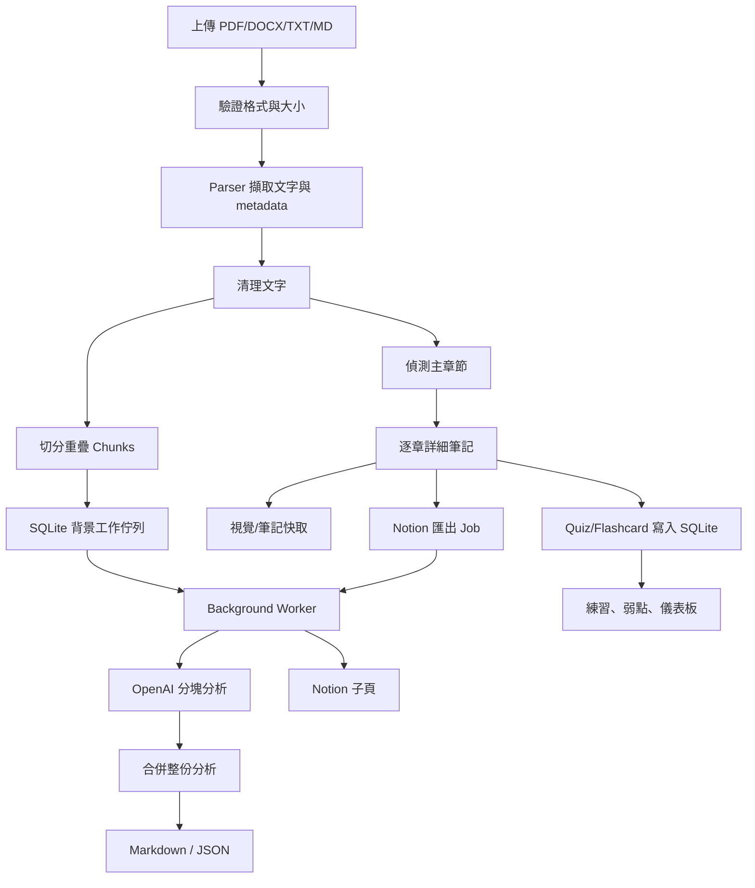

# 端到端資料流

## 主流程



## 1. 上傳與驗證

首頁取得 `UploadedFile`，`file_validator.py` 檢查副檔名和大小。檔案 bytes 用於 SHA-256，避免只靠可能重複的檔名。

## 2. 格式解析

入口依副檔名分派至 `src/parsers/`。不同格式最後都收斂成 `raw_text` 和頁數、段落數、字元數等 metadata，所以下游不必知道來源格式。

## 3. 清理與切塊

`clean_text()` 處理空白和雜訊；`chunk_text()` 依 `CHUNK_SIZE` 切分，並以 `CHUNK_OVERLAP` 保留相鄰上下文，避免定義或段落剛好被切斷。

## 4. 主章節偵測

`detect_chapters()` 會辨識 Module、Chapter、第 N 章，處理 PDF 字元分隔、目錄標題映射、跨行標題、目錄與正文重複序列、相同標題不同編號，以及兩位數 Module。輸出包含 ID、順序、標題、來源、索引和內容。

## 5. 整份文件 AI 分析

`analysis_service.analyze_document()` 逐 Chunk 呼叫 OpenAI。每個回應解析並驗證成 `ChunkAnalysisResult`，最後再由 Merge Prompt 產生 `AnalysisResult`。JSON 不合法時會重試，不讓任意字串進入下游。

## 6. 詳細章節筆記

`chapter_service.analyze_chapter()` 用章節內容、標題與可選的視覺上下文產生 `ChapterLearningNote`，包含摘要、教學、重點、術語、規則、程式碼、錯誤、比較表、Quiz 和 Flash Card。

## 7. PDF 視覺分析

PDF 的代表性頁面會轉成圖片送給視覺模型，辨識圖表、程式畫面和版面資訊。視覺結果與文字一起進 Chapter Prompt。

## 8. 快取

視覺和詳細筆記各有快取。精確 Hash 找不到時，可依 `chapter_id`、來源 ID、順序與標題 fallback。快取代表 AI 產物，不等於 Notion 已匯出，也不等於 SQLite 已有題目。

PDF 視覺快取會把 AI 解讀文字和圖片本體分開保存：JSON 內保留頁碼、標題、說明和圖片檔相對路徑，PNG 圖片另存在同章節快取旁的資料夾。讀取快取時會重新組成 Data URL，供 Notion File Upload API 建立真正的 image block。這避免快取 JSON 過大，也讓重開程式或背景續跑後仍能匯出圖片。

快取 fallback 必須保守。完整文件第一次生成時，第 1 章會先建立快取；如果第 2 章找不到自己的精準 Hash，系統不能因為資料夾裡暫時只有一個快取檔就直接使用它，否則所有後續章節都會變成第 1 章內容。因此目前只接受有明確章節 ID、順序或標題匹配的候選快取。

## 9. Notion 匯出

`create_document_learning_notebook()` 建立父頁與逐章子頁，將 Pydantic Model 轉成原生 Callout、Toggle、Code、Table 和 Image。`export_state_service.py` 記錄父頁、成功與失敗章節，續跑只處理未完成部分。

## 10. SQLite 同步

新生成或命中快取的 Quiz/Flash Card 都可同步到 SQLite，使用 identity 做非破壞性 merge。歷史文件可整份回填，單章異常可只同步指定快取，不必重跑 AI 或修改 Notion。

## 11. Quiz 練習

依文件和章節查題。使用者輸入答案後可展開或收合標準答案，再自評。`save_quiz_attempt()` 在同一交易新增 Attempt 並更新 WeakPoint。

## 12. Flash Card 練習

依章節讀取卡片，翻面後評 0 到 5。服務新增 Review 並更新下一次排程。頁面使用專屬 Session Key，避免 Streamlit rerun 重設索引。

## 13. 儀表板與診斷

儀表板聚合 Attempts、Reviews、Schedules 和 WeakPoints。管理頁檢查每章資料分布、重複與孤兒紀錄，並提供清除、去重和快取同步。

## 失敗恢復

| 失敗位置 | 可利用資料 | 恢復方式 |
|---|---|---|
| Chunk AI | 原始文字 | 重試分析 |
| 詳細筆記 | 視覺快取可能存在 | 只重跑筆記 |
| Notion 某章 | 筆記快取與成功狀態 | 續跑失敗章節 |
| SQLite 題目缺失 | 詳細筆記快取 | 整份或單章回填 |
| 重複題目 | 作答/複習歷史 | 合併重複並轉移關聯 |

設計重點是分層保存昂貴成果，讓重試從最接近失敗的位置開始。
## Gemini 完整生成流程

當設定 `AI_PROVIDER=gemini` 時，資料流中的 AI 節點會改走 Gemini：

```text
PDF/DOCX/TXT/MD
→ Parser 與章節偵測
→ Gemini Chunk 摘要
→ Gemini 合併摘要
→ Gemini PDF 圖片視覺分析
→ Gemini 章節詳細筆記
→ Pydantic 驗證 JSON
→ SQLite 同步 Quiz / Flash Cards
→ Notion 父頁與章節子頁
```

也就是說，Gemini 模式不是只替換「詳細筆記」其中一段，而是可以完整取代 OpenAI 生成整份筆記。Notion 匯出、SQLite、背景工作、快取和資料管理仍沿用原本架構。

## Notion 匯出完成判斷

Notion 匯出不再只依賴 `is_finished=True`。每個章節必須在匯出狀態中保存有效的 Notion 頁面 ID 或 URL，才會被視為完成。若 17 個章節只完成 9 個，畫面會顯示尚有 8 個等待處理，而不會誤報整份完成。

「開始整份 Notion 匯出」代表全新生成，會重新呼叫 AI 並覆蓋章節快取；「繼續未完成的 Notion 匯出」才會使用既有快取跳過已完成章節。
