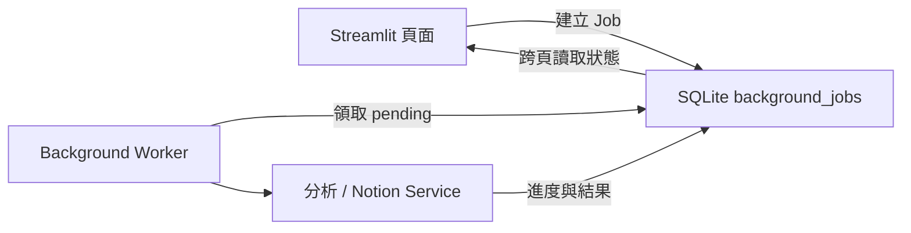
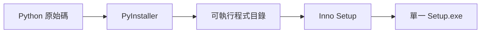

# 背景工作、Windows 封裝與自動更新

## 為什麼需要背景工作

Streamlit 每次互動都會重新執行頁面。若文件分析或整份 Notion 匯出直接綁在按鈕函式內，切換頁面、瀏覽器重整或程序中止都可能讓 UI 與工作狀態失去同步。背景工作佇列把「使用者提出工作」和「真正執行工作」拆開。



## Job 的資料結構

`BackgroundJob` 保存工作種類、狀態、文件 ID、顯示名稱、進度、錯誤、取消要求與時間。大型 Payload 不直接放 SQLite：JSON 位於 `outputs/background_jobs/<job_id>/payload.json`，PDF bytes 等二進位資料放在同工作的 assets 資料夾。

狀態生命週期：

```text
pending -> running -> completed
                   -> failed
                   -> cancelled
```

Worker 異常關閉時，`recover_interrupted_background_jobs()` 在下次啟動將 `running` 放回 `pending`；已有取消要求的工作則完成取消。這是可恢復佇列，不是只有記憶體內的 Thread。

## 程式碼責任

| 檔案 | 責任 |
|---|---|
| `src/database/models.py` | `BackgroundJob` Schema |
| `src/services/background_job_service.py` | 建立、序列化、領取、進度、取消、結果與恢復 |
| `background_worker.py` | 輪詢佇列並分派文件分析或 Notion 匯出 |
| `AI_Notion_筆記整理器.py` | 建立 Job、顯示目前工作並載回完成結果 |
| `pages/6_背景工作.py` | 管理全部工作 |
| `launcher.py` | 同時啟動並關閉 Streamlit 與 Worker |

## Windows 發行架構

PyInstaller 產生的是包含 Python Runtime 與所有套件的應用程式目錄；Inno Setup 再把整個目錄壓縮成一個給使用者下載的安裝 EXE。



這裡的「單一 EXE」是單一安裝程式。安裝後仍會展開 DLL、Python 模組和資源，啟動速度與相容性比 PyInstaller one-file 更穩定。

## 程式與資料分離

安裝檔寫入：

```text
%LOCALAPPDATA%\Programs\AI Notion Note Organizer\
```

個人資料寫入：

```text
%LOCALAPPDATA%\AI Notion Note Organizer\
├── .env
├── outputs\learning_system.db
├── outputs\background_jobs\
├── outputs\chapter_cache\
└── outputs\updates\
```

因此新版安裝程式可以覆蓋程式檔，卻不會覆蓋 API Key、SQLite、快取或學習紀錄。`runtime_paths.py` 負責區分開發與封裝環境。

## 建置 Release

首次安裝建置工具：

```powershell
.venv\Scripts\python.exe -m pip install -r requirements-build.txt
winget install --id JRSoftware.InnoSetup --exact
```

建立安裝檔：

```powershell
powershell -ExecutionPolicy Bypass -File scripts\build_windows_release.ps1
```

腳本只會清理專案內的 `build`、`dist`、`release`，且在刪除前驗證絕對路徑。`.env`、`.venv`、`outputs` 不會進入安裝程式。

## 零設定自動更新

更新來源直接寫在 `update_service.py`，固定為：

```text
https://api.github.com/repos/Allen1208tw/AI-notion-note-organizer/releases/latest
```

應用程式從 Release Tag 取得版本，並只接受固定名稱：

```text
AI_Notion_Note_Organizer_Setup.exe
```

GitHub Release Asset 回應包含 `browser_download_url` 與 `digest`。程式會確認下載網址仍屬於同一個 Repository，並在下載完成後比對 `sha256:` digest；不符時立即刪除。使用者不需要設定 `APP_UPDATE_MANIFEST_URL`、下載額外 JSON 或管理下載主機。

固定一鍵下載網址：

```text
https://github.com/Allen1208tw/AI-notion-note-organizer/releases/latest/download/AI_Notion_Note_Organizer_Setup.exe
```

發行步驟：

1. 更新 `src/version.py`，例如改為 `3.0.1`。
2. 執行所有測試。
3. Commit 並推送程式碼。
4. 建立並推送完全相符的 `v3.0.1` Git Tag；版本不一致時 Workflow 會停止。
5. `.github/workflows/windows-release.yml` 自動測試、封裝並建立 GitHub Release。
6. 用舊版實測檢查、下載、雜湊驗證與安裝。

## 目前限制

- 更新採完整安裝程式，不是差分更新。
- 依目前決定暫不加入 Authenticode 程式碼簽章，因此 Windows 可能顯示未知發行者警告。
- SQLite 佇列定位為單機單 Worker，不是多伺服器分散式 Queue。
- API Key 由使用者資料目錄的 `.env` 管理，不會隨安裝檔散布。
